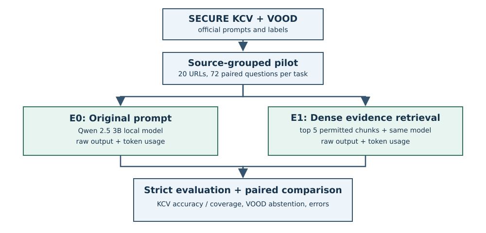

# SECURE-RAG: Evidence Retrieval and Abstention on KCV and VOOD

**Student:** Tulsi Tomar  
**Course:** IMDAI, B.Tech CSE (Cybersecurity), Bennett University  
**Submission:** Milestones 1 and 2 - problem, methodology, working code, and measured output  
**Date:** 23 September 2026

## Abstract

This project studies whether retrieved evidence helps a small local language
model answer CVE questions and abstain when the question lacks vulnerability
context. It uses the official SECURE benchmark's KCV (known-CVE
understanding) and VOOD (missing-context detection) tasks. A paired pilot
selects 20 CVE source URLs and 144 questions, split evenly between KCV and
VOOD. The same Qwen 2.5 3B instruction model answered both E0 (original
prompt) and E1 (top-five dense-retrieved evidence) questions. E1 raised
overall accuracy from 53.47% to 70.14% and VOOD accuracy from 61.11% to
100.00%, but lowered KCV accuracy from 45.83% to 40.28%. An empty-evidence
message in E1 exposes missing context, so the VOOD gain must not be attributed
to semantic retrieval alone.

## 1. Source and question

The SECURE benchmark evaluates LLMs on six cybersecurity tasks, including KCV
and VOOD. This project asks: **can local evidence retrieval improve supported
CVE answers while reducing unsupported answers when the context is absent?**
The original paper and upstream code are listed in the references. The
published full-dataset model scores are not treated as scores for this pilot.

### Problem statement

A small instruction model can give a T/F response to a CVE statement even
when no CVE record is supplied. Retrieved evidence can also omit or distract
from a decisive detail. Build and evaluate a reproducible pipeline that uses
only permitted evidence and measures both supported-answer accuracy and
abstention on paired context-withheld questions.

### Methodology block diagram

The loader reads the official ground truth without editing it. A seeded
source-grouped selector pairs KCV and VOOD questions and records data hashes.
E0 sends the official prompt; E1 ranks chunks from supplied context with dense
embeddings and sends the five best to the same local model. Both branches
record raw outputs and token usage, followed by strict task-level evaluation
and paired error comparison. E2 BM25 plus dense fusion is implemented for a
later controlled experiment; E3-E5 are outside this Milestone 2 result.

### Novelty, contribution, and societal relevance

This pilot combines paired answerable and context-withheld CVE questions,
provenance of official data, strict T/F/X scoring, and retrieval-versus-
reasoning error analysis for an affordable local 3B model. It shows that an
overall RAG gain can coincide with worse supported-answer accuracy. The
SECURE paper introduced the benchmark and evaluated models and retrieval;
this work examines this specific paired small-model setup and identifies an
abstention prompt confound. Dense RAG itself is not claimed as a new algorithm.

An analyst-facing advisory tool that reveals missing evidence could reduce
unsupported cybersecurity advice, and local inference may suit teams with
limited resources. These are potential impacts: no deployment, user study, or
verified safety improvement has been conducted. Human review remains needed.

## 2. Method

The official KCV and VOOD files contain 466 rows each. Matching rows refer to
the same CVE source URL and question. The immutable pilot manifest records the
upstream commit `a2412e8ab4b6051ba7381d4f590cb48d9743c7c8`, seed
`20260920`, selected source URLs, and SHA-256 digests of both official files.
The selected 20 URLs yield 72 KCV and 72 paired VOOD questions. KCV has 46 F
and 26 T labels; all 72 VOOD labels are X. The original labels are unchanged.

E0 sends the original benchmark prompt, which includes the CVE JSON for KCV
and omits it for VOOD. E1 flattens the *provided* CVE JSON into path-aware
chunks, embeds the question and chunks using `embeddinggemma:latest`, ranks by
cosine similarity, and inserts up to five chunks in the prompt. VOOD has no
provided CVE context; E1 explicitly says "No evidence was provided." It never
looks up the withheld CVE for VOOD. Both inference runs use
`qwen2.5:3b-instruct`, temperature 0, maximum four output tokens, and requested
seed `20260920`. The available record does not independently establish whether
the inference server honored that seed or specify the original Mac hardware.

The evaluator accepts only the entire stripped output `T`, `F`, or `X`. Invalid
answers are errors in scoring, not repaired labels. Accuracy and macro-F1 are
reported separately by task; KCV coverage is the fraction answered T/F.
Abstention precision and recall use X as the positive class over both tasks.
The code uses Python's standard library at runtime, with no paid API.

## 3. Measured results

| Measure | E0 original prompt | E1 dense evidence | Change |
|---|---:|---:|---:|
| Overall accuracy (144 rows) | 53.47% | 70.14% | +16.67 pp |
| Overall macro-F1 | 54.70% | 64.61% | +9.91 pp |
| KCV accuracy (72 rows) | 45.83% | 40.28% | -5.56 pp |
| KCV coverage | 55.56% | 48.61% | -6.94 pp |
| KCV accuracy among answered | 82.50% | 82.86% | +0.36 pp |
| VOOD accuracy (72 rows) | 61.11% | 100.00% | +38.89 pp |
| Unsupported-answer rate on VOOD | 38.89% | 0.00% | -38.89 pp |
| Abstention F1 | 59.46% | 79.56% | +20.10 pp |

All 72 E1 VOOD outputs were X. KCV changed from 33 to 29 correct: seven
previously correct questions regressed, while three previously incorrect
questions improved. Six of the seven KCV regressions already had relevant
answer-bearing evidence in the retrieved top five on manual inspection. One
regression (`kcv-0307`) lacked decisive mitigation evidence in those passages.
These findings suggest that ranking alone cannot explain or repair most of the
observed KCV failures.

\newpage

### Token and runtime accounting

| Run | Prompt tokens | Completion tokens | Total tokens | Sum of recorded request latencies |
|---|---:|---:|---:|---:|
| E0 | 110,430 | 288 | 110,718 | 70.03 s |
| E1 | 121,471 | 288 | 121,759 | 138.82 s |

These token counts come from the 144 stored inference responses in each run.
They cover generator inference, excluding embedding calls. The summed request
latencies are not a controlled end-to-end benchmark; cache warmup and system
load may differ. E1 used 11,041 more prompt tokens than E0.

## 4. Error analysis and validity

- The VOOD prompt explicitly announces that no evidence was supplied. E1's
  perfect VOOD score shows successful response to that cue in this pilot; a
  study of semantic retrieval alone requires a controlled prompt ablation.
- Dense cosine similarity did not predict correctness: mean top scores were
  0.5593 for correct KCV answers, 0.5683 for abstentions, and 0.5955 for wrong
  T/F answers. A global similarity threshold would not be justified here.
- The source-grouped pilot limits duplicate CVE information within comparisons,
  but it is one small selected set, not an independent held-out final test.
  Changes chosen after inspecting these outcomes require another source-grouped
  evaluation set before making a generalization claim.
- The current T/F/X output format has no citation field. Evidence-citation
  correctness and claim-level verification have therefore **not** been
  measured. Abstention is likewise a model output rather than a calibrated
  probability or validated evidence-sufficiency score.
- The published Llama 3 results involve different models and the full SECURE
  datasets. Their scores are not directly comparable to these local Qwen pilot
  measurements.

## 5. Implemented next experiment and remaining work

E2 preparation is implemented and unit tested: standard-library BM25 scores
the same context chunks, reciprocal rank fusion combines lexical and dense
rankings, and the same top-five evidence budget is retained. It reuses or
rebuilds an embedding cache. **E2 inference and metrics are not present in the
archive**, because this execution environment has no local Ollama models or
the E1 embedding cache. `RUN_ON_MAC.md` gives exact commands to produce them
using the original Mac. E3 reranking, E4 evidence verification and abstention,
and optional E5 CVSS calculation remain proposed stages, not implemented or
claimed experiments. The immediate research priority is to isolate the VOOD
prompt effect and address KCV claim verification on a separate source set.

## 6. Reproducibility and files

The package contains the Python source, 17 unit tests, the fixed pilot
manifest/examples, E0/E1 raw predictions and metrics, E1 retrieval output,
and the paired comparison report. From the project directory run
`PYTHONPATH=src python3 -m unittest discover -s tests -v`, then
`PYTHONPATH=src python3 -m secure_rag evaluate` with the paths given in the
README. `DEMO.md` contains the lab demonstration commands. To re-create the pilot from original files, check out the upstream
revision recorded above; the official TSV files are intentionally not copied
into the package.

## References

1. D. Bhusal et al., *SECURE: Benchmarking Generative Large Language Models
   for Cybersecurity Advisory*, ACSAC 2024, DOI:
   https://doi.org/10.1109/ACSAC63791.2024.00019
2. Official source and data: https://github.com/aiforsec/SECURE
3. Preprint: https://arxiv.org/abs/2405.20441
